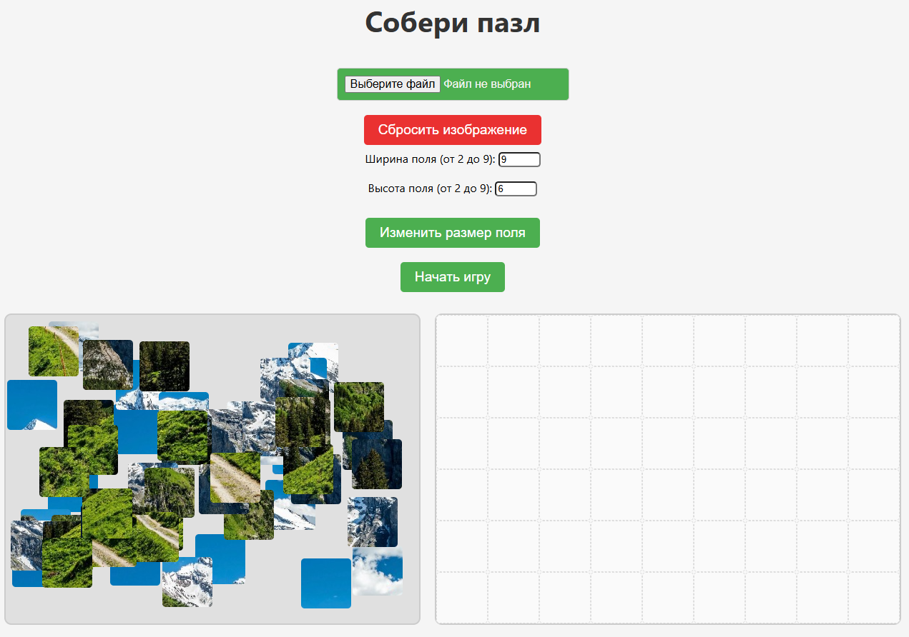

# Игра «Собери пазл»

Проект представляет собой веб-приложение для сборки пазлов, которое позволяет пользователю загрузить изображение, выбрать размер сетки и собрать изображение, перемещая кусочки пазла.

## Основные возможности

- **Загрузка изображения**: Вы можете загрузить свое изображение или использовать изображение по умолчанию.
- **Изменение размеров поля**: Настройка размеров сетки пазла от 2x2 до 9x9.
- **Перетаскивание элементов**: Удобный интерфейс для перетаскивания кусочков пазла.
- **Проверка правильности**: Кусочки автоматически фиксируются, если они расположены правильно.
- **Сброс**: Возможность сбросить изображение и начать заново.

## Как использовать

1. Загрузите изображение, нажав на кнопку «Выберите файл».
2. Настройте размеры поля (ширина и высота) с помощью полей ввода. Укажите значение от 2 до 9.
3. Нажмите «Начать игру», чтобы сгенерировать пазл.
4. Перемещайте кусочки пазла, чтобы собрать изображение.
5. Если все кусочки находятся на правильных местах, вы увидите сообщение о победе.

## Структура проекта

- **HTML**: Основная разметка страницы, включая элементы управления.
- **CSS**: Стили для оформления интерфейса и анимации.
- **JavaScript**: Логика работы игры:
  - Загрузка и обработка изображений.
  - Генерация сетки пазла и кусочков.
  - Перетаскивание кусочков и проверка правильности их расположения.

## Установка и запуск
Скачайте проект и откройте файл `index.html` в браузере.

## Демонстрация игры

